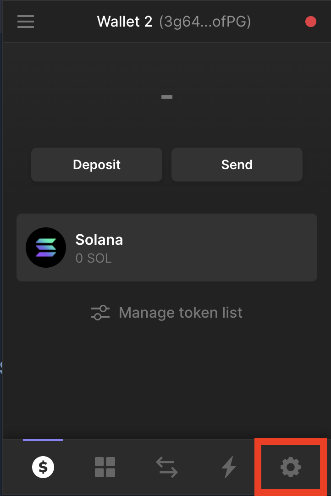
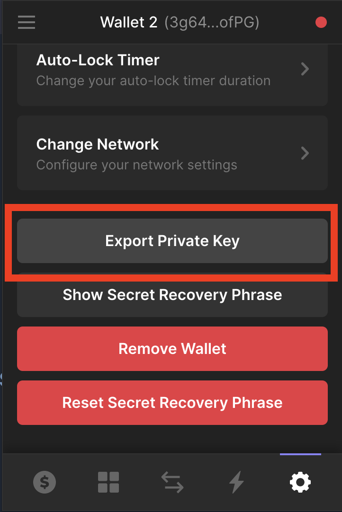
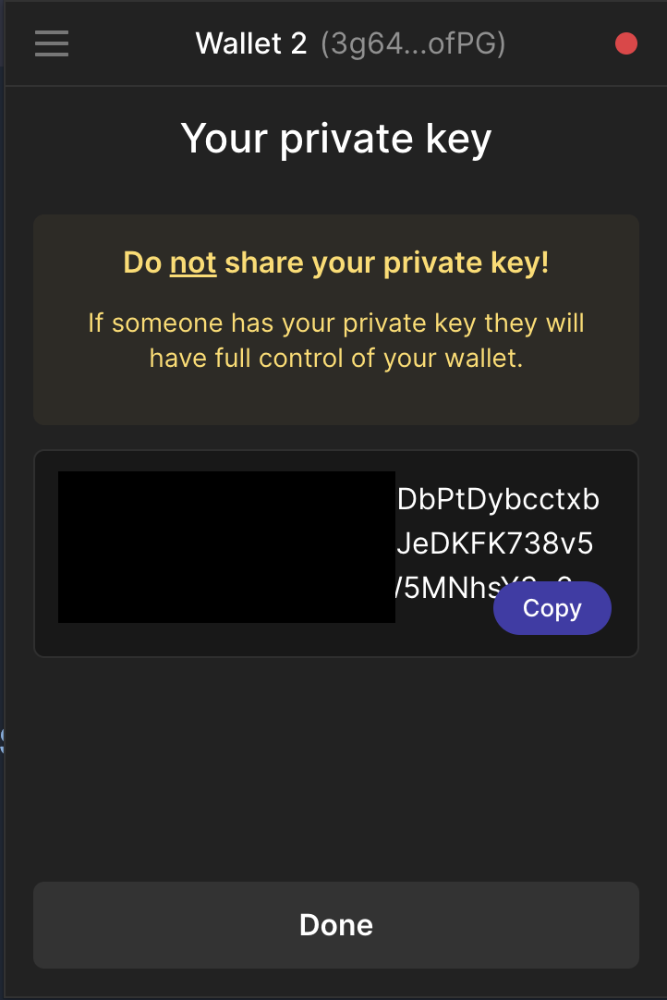

## Installation guide

To run this CLI you need Solana CLI and Rust lang be installed on you machine.

To install Rust lang run next command in the terminal: `curl --proto '=https' --tlsv1.2 -sSf https://sh.rustup.rs | sh`

Next we should install Solana CLI: `sh -c "$(curl -sSfL https://release.solana.com/v1.10.8/install)"`

Once you have installed these tools we can move to the next steps.

## Vesting creation guide

This CLI mostly copy original Bonfida vesting program CLI but adds some new useful features like base58 private key support and json file with vesting schedules.

So to use it you need Phantom wallet with created account in it.

To create vesting contract it supposed that you already have token account with some amounts of tokens you want to distribute.

First of all let's fill in `vesting.json` file.

Here is an example of what it might look like:
```
{
    "key": "779ajrhYR7Woez3TbAoBSgYwXLkVmLEvWY6iWcGkk1no",
    "receiver_key_type": "Wallet",
    "mint": "4pM5pFnmhzVCSZnQHq3dkNXYC5SLtkmHYce16VmRghbY",
    "schedules": [
                {"release_time": 1650326333, "amount": 3000000000000}
            ]
}
```

Where:

`key` - receiver account pubkey

`receiver_key_type` - type of receiver account was set. It can be either `Wallet` or `TokenAcc`. If we set `Wallet` CLI will create new associated token account for pointed wallet key to receive vested funds and therefore if we set `TokenAcc` it will not create any new token accounts.

`mint` - mint key of tokens we are going to distribute.

`schedules` - list of vesting schedules where `release_time` it's UnixTimestamp of unlock date and `amount` it's actually amount of tokens. **PAY ATTENTION** that `amount` is set with precision. It means that amount of tokens you want to distribute should be multiplied by decimals of token mint. For example if we have a mint account with decimals = 6 and we want to distribute 10_000 tokens it means that in `amount` field we have to put 10_000 * 1000000 = 10_000_000_000

Once json file is ready we can launch command to create vesting contract:
```
cargo run -- --payer-keypair MUovFFrR2a3cHD9TwkuiyuXuzmze7SjioUaUGjCYekUwhqiR3QH3qNqq3K9rhxKh6dA6swmfPvAZxZuQ4qgnpeZ create --vesting-data-file ./vesting.json
```

After you launch this command you will see output like this:
```
The seed of the contract is: c8fpTXm3XTRgE5maYQ24Li4L65wMYvAFomzXknxVF2V
Please write it down as it is needed to interact with the contract!
The vesting account pubkey: 4XNHJ9nznX5Hb2maNrge4W8VqWTMBpv8GTp6kZx7zW3Y
Tx signature: 4HfeiFnhCsKY6WdqdjAao2jdfmHJtovbPeFoeYBMijjjT6BvcY6kP3zsTDK6ZAxBYaLiHxwYezNvsKuiTFZxKnui
```

Please save seed of the contract key. It's very important because you will need it to unlock tokens.

You can see that we set `payer-keypair` value as base58 string. You can find this value in your Phantom wallet. More specifically go to the `settings` -> `Export Private Key`.







And that's it vesting contract is created.

The next step will be unlock tokens when the time comes.

To run unlock command you need seed generated during vesting contract creation.

Command looks like this:
```
cargo run -- --payer-keypair MUovFFrR2a3cHD9TwkuiyuXuzmze7SjioUaUGjCYekUwhqiR3QH3qNqq3K9rhxKh6dA6swmfPvAZxZuQ4qgnpeZ unlock --vesting-seed c8fpTXm3XTRgE5maYQ24Li4L65wMYvAFomzXknxVF2V
```

Unlock is permissionless instruction so anyone can call it and smart contract will transfer locked tokens to the right address.
